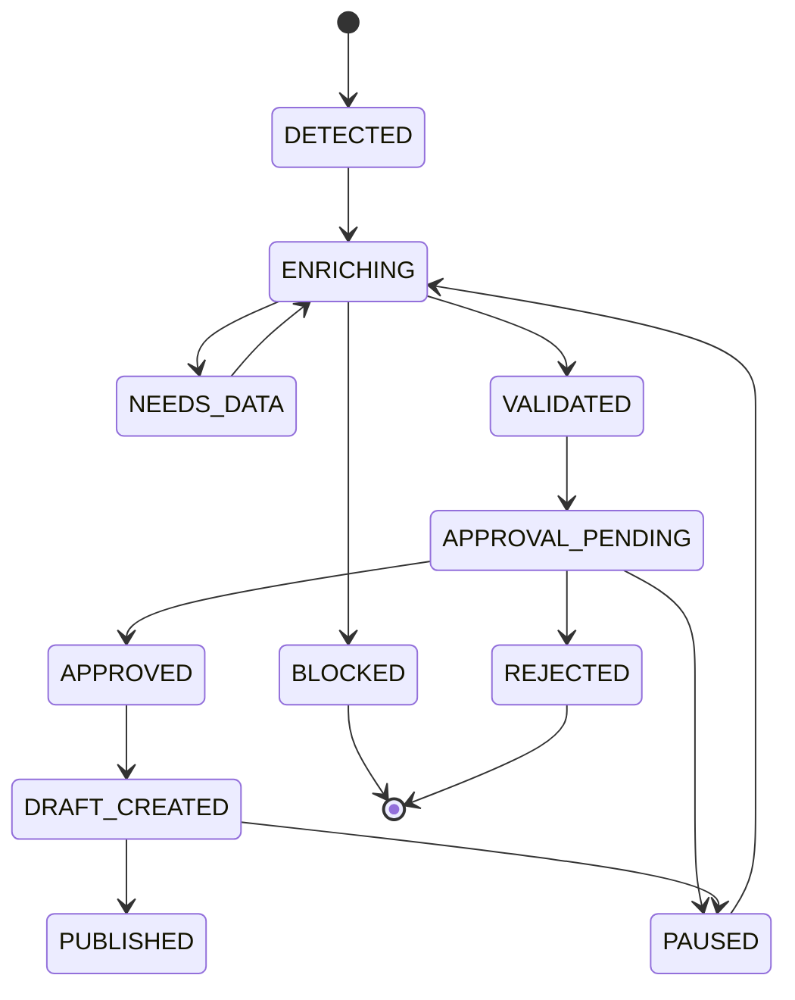

# PROPOSED_STATE_MACHINE — eBay Winner Pipeline

## Estados permitidos

- `DETECTED`: candidato identificado desde Radar.
- `ENRICHING`: se están normalizando/enriqueciendo datos.
- `NEEDS_DATA`: faltan datos obligatorios recuperables.
- `BLOCKED`: no puede avanzar por restricción dura o riesgo.
- `VALIDATED`: datos, compliance y profit pasaron reglas mínimas.
- `APPROVAL_PENDING`: enviado a aprobación humana/WhatsApp.
- `APPROVED`: aprobado para crear draft local.
- `DRAFT_CREATED`: borrador local eBay creado; no publicado.
- `PUBLISHED`: reservado para fase futura con eBay real.
- `PAUSED`: detenido manualmente o por condición temporal.
- `REJECTED`: rechazado por humano o regla de negocio.

## Diagrama

## Transiciones idempotentes

| Transición | Condición | Idempotency key sugerida |
|---|---|---|
| `DETECTED` | `candidate_key` no existe | `detect:{candidate_key}` |
| `DETECTED → ENRICHING` | Candidato creado o actualizado | `enrich:{candidate_id}:{snapshot_id}` |
| `ENRICHING → NEEDS_DATA` | `missing_fields` no vacío | `needs-data:{candidate_id}:{validation_version}` |
| `ENRICHING → BLOCKED` | Compliance duro falla | `blocked:{candidate_id}:{check_version}` |
| `ENRICHING → VALIDATED` | Validación + compliance + profit pasan | `validated:{candidate_id}:{score_version}` |
| `VALIDATED → APPROVAL_PENDING` | Mensaje WhatsApp/admin enviado | `approval-request:{candidate_id}:{message_template_version}` |
| `APPROVAL_PENDING → APPROVED` | Decisión humana approve | `decision:{candidate_id}:{message_id}:approve` |
| `APPROVAL_PENDING → REJECTED` | Decisión humana reject | `decision:{candidate_id}:{message_id}:reject` |
| `APPROVED → DRAFT_CREATED` | Draft local generado | `draft:{candidate_id}:{draft_version}` |
| `DRAFT_CREATED → PUBLISHED` | Fase futura eBay real | `publish:{candidate_id}:{ebay_listing_id}` |

## Reglas de protección

- `PUBLISHED` no debe ser alcanzable en esta fase.
- `BLOCKED` solo puede salir mediante acción admin explícita futura; por defecto terminal.
- `REJECTED` es terminal salvo reapertura manual auditada.
- Toda transición debe escribir `ebay_winner_audit_log`.
- Todo cálculo debe guardar versión y assumptions.
- No usar `opportunity_score` como autorización automática para publicar.
